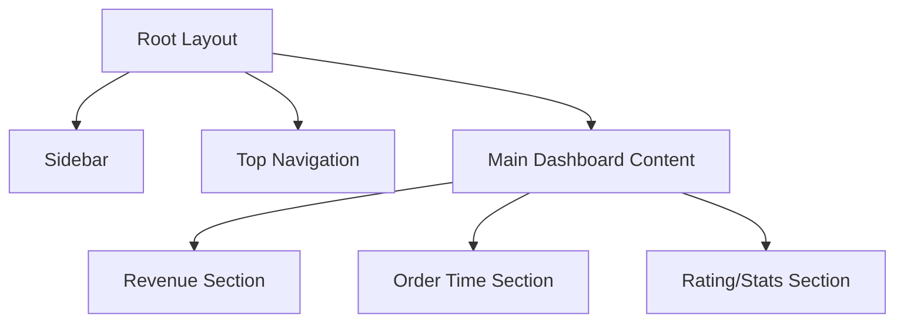

# GoodFood - Ordering Management Dashboard

A modern, high-performance food ordering management dashboard built with Next.js 16 and React 19. Manage revenues, orders, and customer ratings with a seamless, responsive interface.


## 🔗 Demo Links

- **Live Demo:** [goodfood-test.vercel.app](https://goodfood-test.vercel.app)
- **GitHub Repository:** [View Code](https://github.com/Davidson3556/Dashboard-test)

---

## ✨ Features

### Core Functionality

- **Revenue Analytics** - Interactive bar charts showing weekly sales performance with percentage comparisons.
- **Order Time Distribution** - Visual breakdown of peak order times (Morning, Afternoon, Evening) using donut charts.
- **Customer Ratings** - Detailed rating circles for Food Taste, Hygiene, and Packaging.
- **Order Management** - Real-time tracking of most ordered items and overall order trends.
- **Splash Screen** - Branded loading experience with smooth transitions.

### User Experience

- **Premium UI/UX** - Clean, professional interface with Figma-aligned design and soft colors.
- **Responsive Navigation** - Slide-out drawer menu for mobile users with an intuitive hamburger toggle.
- **Interactive Charts** - Responsive containers and tooltips using Recharts for data visualization.
- **Fast Performance** - Optimized with Next.js App Router and Tailwind CSS 4.
- **Accessibility** - Semantic HTML and ARIA-compliant UI components from Radix UI.

### Coming Soon

- Live Orders Feed
- Detailed Customer Feedback analytics
- Multi-restaurant support

## 🛠️ Tech Stack

| Technology         | Purpose                                          |
| ------------------ | ------------------------------------------------ |
| **Next.js 16**     | React framework with App Router                  |
| **React 19**       | UI library                                       |
| **TypeScript**     | Type safety                                      |
| **Tailwind CSS 4** | Utility-first styling                            |
| **Radix UI**       | Accessible UI primitives (Dropdowns, Separators) |
| **Lucide React**   | Icon library                                     |
| **Recharts**       | Data visualization (Bar, Pie, Line charts)       |

## 📁 Project Structure

```
├── app/
│   ├── globals.css          # Global styles & Tailwind 4 configuration
│   ├── layout.tsx           # Root layout with fonts & metadata
│   ├── page.tsx             # Main Dashboard page with layout & cards
│   └── loading.tsx          # Default loading state
├── components/
│   ├── cards/               # Dashboard-specific chart components
│   │   ├── RevenueCard.tsx      # Bar chart for revenue
│   │   ├── OrderTimeCard.tsx    # Pie chart for order distribution
│   │   ├── RatingCard.tsx       # Custom rating circles
│   │   ├── MostOrderedCard.tsx  # Top food items list
│   │   └── OrderCard.tsx        # Line chart for order trends
│   ├── ui/                  # Reusable UI components (Shadcn/UI)
│   ├── Sidebar.tsx          # Navigation sidebar with mobile drawer
│   └── TopNav.tsx           # Top navigation with search and profile
├── lib/
│   └── utils.ts             # General utility functions
└── public/
    ├── icons/               # Feature-specific icons (Order, Review, etc.)
    └── Logo.png             # Main branding logo
```

---

## 🚀 Getting Started

### Prerequisites

- Node.js 18+
- npm or yarn

### Installation

1. **Clone the repository**

   ```bash
   git clone https://github.com/Davidson3556/Dashboard-test.git
   cd Dashboard-test
   ```

2. **Install dependencies**

   ```bash
   npm install
   ```

3. **Run the development server**

   ```bash
   npm run dev
   ```

4. **Open in browser**
   ```
   http://localhost:3000
   ```

---

## 📜 Available Scripts

| Command         | Description              |
| --------------- | ------------------------ |
| `npm run dev`   | Start development server |
| `npm run build` | Build for production     |
| `npm run start` | Start production server  |
| `npm run lint`  | Run ESLint               |

---

## 🔄 Dashboard Architecture



### Dashboard Layout

- **Sidebar**: Fixed on desktop, toggleable drawer on mobile.
- **TopNav**: Full-width search and profile management.
- **Main Content**: Responsive grid that adapts from 1 column on mobile to 3 columns on large screens.

---

## 💭 Design Decisions

| Decision                | Rationale                                                                 |
| ----------------------- | ------------------------------------------------------------------------- |
| **Shadcn UI**           | Chose for its accessibility and clean, customizable primitives.           |
| **Recharts**            | Used for its excellent React integration and responsive chart containers. |
| **Client Side State**   | Managed sidebar and loading states efficiently using React hooks.         |
| **Vertical Separators** | Implemented using Shadcn Separator for precise Figma-aligned dividers.    |

---

## 🎨 Design System

### Colors

| Color      | Hex       | Usage                   |
| ---------- | --------- | ----------------------- |
| Primary    | `#5A6ACF` | Active states, branding |
| Heading    | `#1F384C` | Dashboard title, text   |
| Separator  | `#C8CBD9` | Dividers and borders    |
| Background | `#F1F2F7` | Sidebar/Page background |

### Typography

- **Poppins** - Clean, modern font for a professional dashboard feel.

---


This project was created as part of a frontend assessment.
